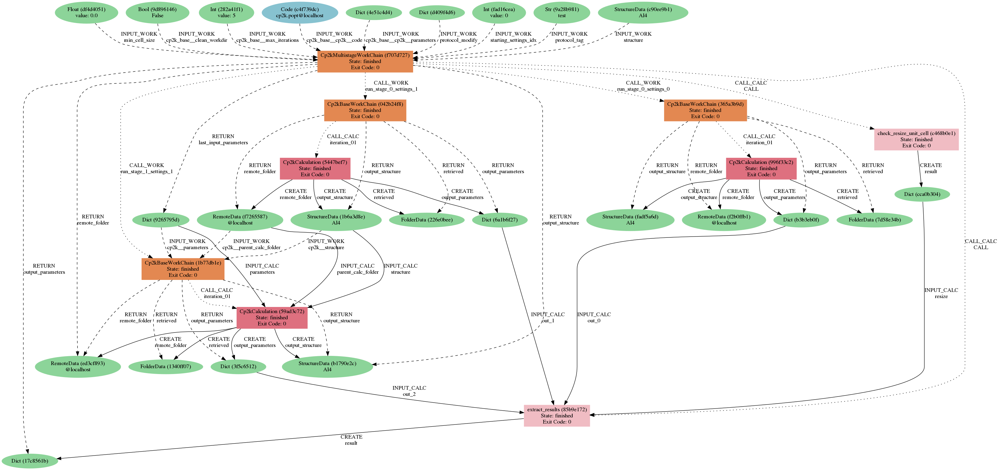

===============
Getting started
===============

This plugin is a collection of work chains and calculation functions that combine the use of multiple codes
(e.g., CP2K, DDEC, Raspa, Zeo++, ...) to achieve advanced automated tasks.

Installation
++++++++++++

Use the following commands to install the plugin::

    git clone https://github.com/yakutovicha/aiida-lsmo .
    cd aiida-lsmo
    pip install -e .

.. note:: This will install also the related plugins (e.g., `aiida-cp2k`, `aiida-raspa`, ...) if not present already,
          but the codes (e.g, CP2K, RASPA, ...) need to be set up before using these work chains.

Usage
+++++

Consider that, for each work chain, at least one example is provided in the ``examples`` directory: these examples are
usually quick and you can run them on your localhost in a couple of minutes.

A quick demo on how to submit a work chain::

    verdi daemon start         # make sure the daemon is running
    cd examples
    verdi run run_IsothermWorkChain_HKUST-1.py raspa@localhost zeopp@localhost

Note that in the running script, the work chain is imported using the ``WorkflowFactory``::

    from aiida.plugins import WorkflowFactory

    IsothermWorkChain = WorkflowFactory('lsmo.isotherm')

while a calculation function is imported with the ``CalculationFactory``::

  from aiida.plugins import CalculationFactory

  FFBuilder = CalculationFactory('lsmo.ff_builder')

After you run the work chain you can inspect the log, for example::

  $ verdi process report

  2019-11-22 16:54:52 [90962 | REPORT]: [266248|Cp2kMultistageWorkChain|setup_multistage]: Unit cell was NOT resized
  2019-11-22 16:54:52 [90963 | REPORT]: [266248|Cp2kMultistageWorkChain|run_stage]: submitted Cp2kBaseWorkChain for stage_0/settings_0
  2019-11-22 16:54:52 [90964 | REPORT]:   [266252|Cp2kBaseWorkChain|run_calculation]: launching Cp2kCalculation<266253> iteration #1
  2019-11-22 16:55:13 [90965 | REPORT]:   [266252|Cp2kBaseWorkChain|inspect_calculation]: Cp2kCalculation<266253> completed successfully
  2019-11-22 16:55:13 [90966 | REPORT]:   [266252|Cp2kBaseWorkChain|results]: work chain completed after 1 iterations
  2019-11-22 16:55:14 [90967 | REPORT]:   [266252|Cp2kBaseWorkChain|on_terminated]: remote folders will not be cleaned
  2019-11-22 16:55:14 [90968 | REPORT]: [266248|Cp2kMultistageWorkChain|inspect_and_update_settings_stage0]: Bandgaps spin1/spin2: -0.058 and -0.058 ev
  2019-11-22 16:55:14 [90969 | REPORT]: [266248|Cp2kMultistageWorkChain|inspect_and_update_settings_stage0]: BAD SETTINGS: band gap is < 0.100 eV
  2019-11-22 16:55:14 [90970 | REPORT]: [266248|Cp2kMultistageWorkChain|run_stage]: submitted Cp2kBaseWorkChain for stage_0/settings_1
  2019-11-22 16:55:15 [90971 | REPORT]:   [266259|Cp2kBaseWorkChain|run_calculation]: launching Cp2kCalculation<266260> iteration #1
  2019-11-22 16:55:34 [90972 | REPORT]:   [266259|Cp2kBaseWorkChain|inspect_calculation]: Cp2kCalculation<266260> completed successfully
  2019-11-22 16:55:34 [90973 | REPORT]:   [266259|Cp2kBaseWorkChain|results]: work chain completed after 1 iterations
  2019-11-22 16:55:34 [90974 | REPORT]:   [266259|Cp2kBaseWorkChain|on_terminated]: remote folders will not be cleaned
  2019-11-22 16:55:35 [90975 | REPORT]: [266248|Cp2kMultistageWorkChain|inspect_and_update_settings_stage0]: Bandgaps spin1/spin2: 0.000 and 0.000 ev
  2019-11-22 16:55:35 [90976 | REPORT]: [266248|Cp2kMultistageWorkChain|inspect_and_update_stage]: Structure updated for next stage
  2019-11-22 16:55:35 [90977 | REPORT]: [266248|Cp2kMultistageWorkChain|run_stage]: submitted Cp2kBaseWorkChain for stage_1/settings_1
  2019-11-22 16:55:35 [90978 | REPORT]:   [266266|Cp2kBaseWorkChain|run_calculation]: launching Cp2kCalculation<266267> iteration #1
  2019-11-22 16:55:53 [90979 | REPORT]:   [266266|Cp2kBaseWorkChain|inspect_calculation]: Cp2kCalculation<266267> completed successfully
  2019-11-22 16:55:53 [90980 | REPORT]:   [266266|Cp2kBaseWorkChain|results]: work chain completed after 1 iterations
  2019-11-22 16:55:54 [90981 | REPORT]:   [266266|Cp2kBaseWorkChain|on_terminated]: remote folders will not be cleaned
  2019-11-22 16:55:54 [90982 | REPORT]: [266248|Cp2kMultistageWorkChain|inspect_and_update_stage]: Structure updated for next stage
  2019-11-22 16:55:54 [90983 | REPORT]: [266248|Cp2kMultistageWorkChain|inspect_and_update_stage]: All stages computed, finishing...
  2019-11-22 16:55:55 [90984 | REPORT]: [266248|Cp2kMultistageWorkChain|results]: Outputs: Dict<266273> and StructureData<266271>

You can also inspect the inputs/outputs in a single glance with ``verdi node show``, for example::

  $ verdi node show 266248

  Property     Value
  -----------  ------------------------------------
  type         Cp2kMultistageWorkChain
  state        Finished [0]
  pk           266248
  uuid         f707d727-f7c2-4232-a90c-d9e2711e5fe6
  label
  description
  ctime        2019-11-22 16:54:51.692140+00:00
  mtime        2019-11-22 16:55:55.239555+00:00
  computer     [21] localhost

  Inputs                 PK      Type
  ---------------------  ------  -------------
  cp2k_base
      clean_workdir      266246  Bool
      max_iterations     266245  Int
      cp2k
          code           265588  Code
          parameters     266244  Dict
  min_cell_size          266247  Float
  protocol_modify        266243  Dict
  protocol_tag           266241  Str
  starting_settings_idx  266242  Int
  structure              266240  StructureData

  Outputs                    PK  Type
  ---------------------  ------  -------------
  last_input_parameters  266265  Dict
  output_parameters      266273  Dict
  output_structure       266271  StructureData
  remote_folder          266268  RemoteData

  Called                      PK  Type
  ----------------------  ------  ----------------
  CALL                    266272  CalcFunctionNode
  run_stage_1_settings_1  266266  WorkChainNode
  run_stage_0_settings_1  266259  WorkChainNode
  run_stage_0_settings_0  266252  WorkChainNode
  CALL                    266249  CalcFunctionNode

  Log messages
  ----------------------------------------------
  There are 11 log messages for this calculation
  Run 'verdi process report 266248' to see them

Another good idea is to print the graph of your workflow with ``verdi node graph generate``,
to inspect all its internal steps:

