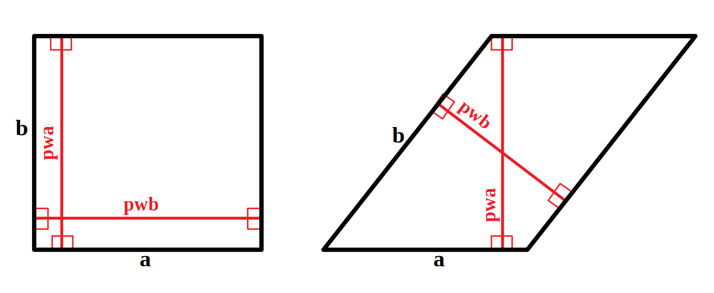
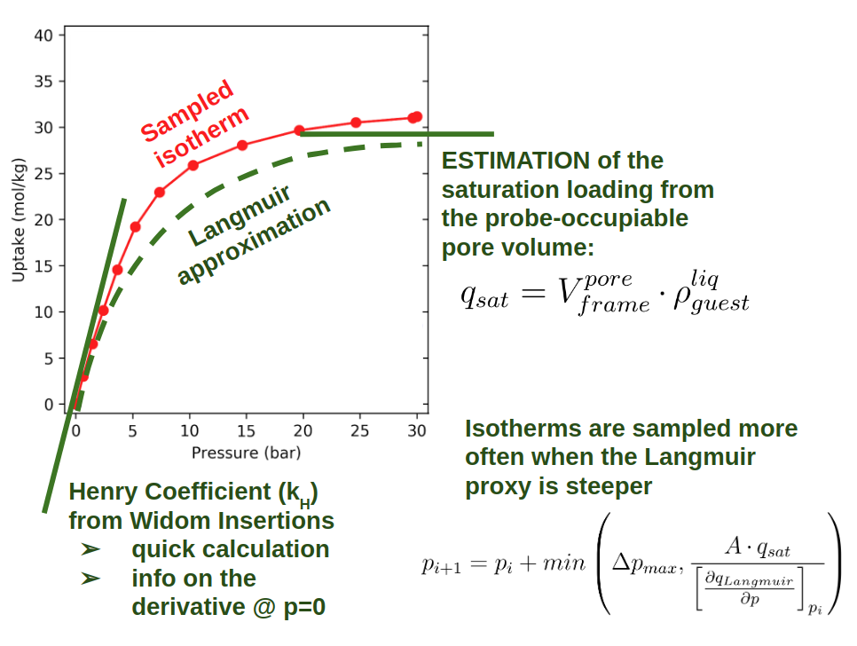

=====================================
Tecnicalities
=====================================

Unit cell expansion
+++++++++++++++++++++++

With periodic boundary conditions the lengths of the simulation box should bigger than twice the cutoff value.
Therefore, for an orthogonal cells one should multiply the cell until its length meets this criterion in every direction.

In case of non-orthogona cells however, one should not speak in terms of "lengths" but instead in terms of "perpendicular
lengths", as shown in the figure for the two-dimensional case. While in the orthogonal case
one can simplify **pwa = b** and **pwb = a**, in a tilted unit cell we have to compute
**pwa** and **pwb** and then evaluate if the cell needs to be expanded,
and the multiplication coefficients.

    Perpendicular widths in orthogonal and tilted 2D cells.

This explains why we need so much math in the function :py:func:`~aiida_lsmo.utils.multiply_unitcell.check_resize_unit_cell`,
to compute the Raspa input "UnitCells".

Note that if you do not multiply correctly the unit cell, Raspa will complain in the output::

    WARNING: INAPPROPRIATE NUMBER OF UNIT CELLS USED

which typically results in a lower uptake then the correct one: if the cell is smaller than twice the cutoff,
less interactions are computed because each particle sees some artificial vacuum beyond the unit cell.
This results in weaker average interactions and therefore lower uptake at a given pressure/temperature.

Isotherm's pressures selection
+++++++++++++++++++++++++++++++++++++++++++++++

In the Isotherm work chain we use the function :py:func:`~aiida_lsmo.workchains.isotherm.choose_pressure_points`,
which can automatically select the pressure points for an adequate sampling of the isotherm curve.
The method, presented in our `publication <https://doi.org/10.1021/acscentsci.9b00619>`_ and resumed in the figure,
is based on a preliminary estimation of the Henry coefficient and pore volume. From these, a Langmuir isotherm is
derived and used as a proxy to determine the pressure points.
The input values the user has to specify are ``pressure_min``, ``pressure_max``, ``pressure_maxstep`` and ``pressure_precision``.
This last is the **A** coefficient in the figure: 0.1 is the default value, but we recommend to test around 0.05 for a
more accurate sampling, i.e., a higher resolution of the isotherm curve in the low pressure region.

.. note:: This method works only for sampling `Type I <http://www.chemistrylearning.com/adsorption-isotherm/>`_
          isotherms: it fails to correctly sample inflection curve in case of strong cooperative adsorption, e.g.,
          a typical water isotherm.
