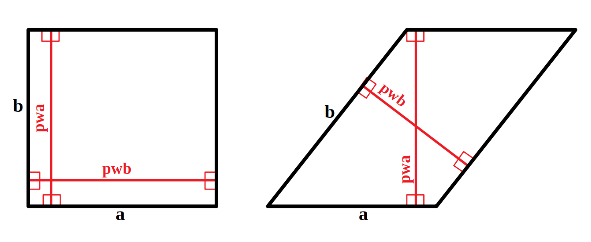
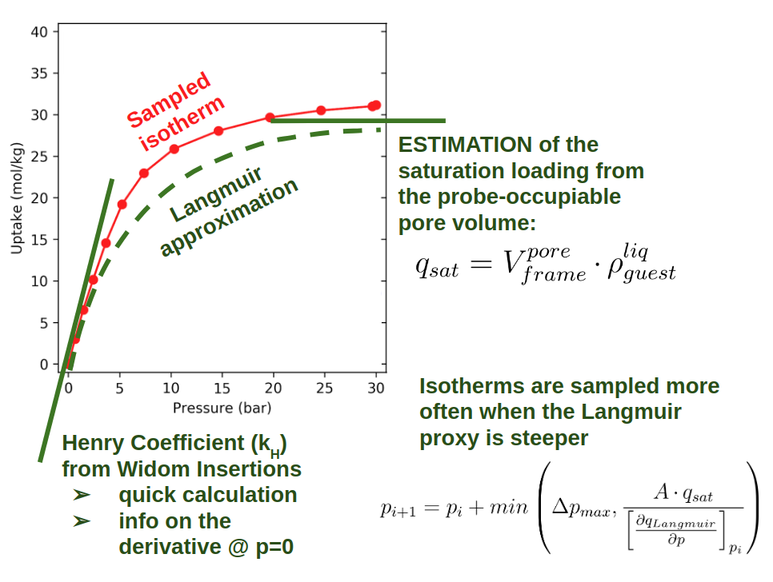

=====================================
Tecnicalities
=====================================

Unit cell expansion
+++++++++++++++++++++++

You learned that the lengths of your simulation box should bigger than twice the cutoff value.\\
Therefore, for an orthogonal cell you should multiply you cell until its length
meets this criterion in every direction.

But what if the cell is not orthogonal?

You should not speak in terms of "lengths" but in terms of "perpendicular lengths",
as shown in the figure for the two-dimensional case. While in the orthogonal case
one can simplify pwa = b and pwb = a, in a tilted unit cell we have to compute
pwa and pwb and then evaluate if the cell needs to be expanded,
and the multiplication coefficients.




    Perpendicular widths in orthogonal and tilted 2D cells.


This explains why we need so much math in the function `multiply_unit_cell(cif)`,
to compute the Raspa input "UnitCells".

Note that if you do not multiply correctly the unit cell,
Raspa will complain in the output:

```terminal
WARNING: INAPPROPRIATE NUMBER OF UNIT CELLS USED
```

and you will (usually) get an uptake that is less then the correct one. Why?

.. note:: The answer is that if the cell is smaller than twice the cutoff, less interactions are computed because each
          particle does not see some of the other particles that are present in the periodic boundary. This results
          in weaker average interactions and therefore lower uptake at a given pressure/temperature.


Isotherm's automated pressure point selection
+++++++++++++++++++++++++++++++++++++++++++++++



.. note:: This method works only for sampling *Type I* isotherms: it fails to correctly sample inflection curves
          in case of strong cooperative adsorption, e.g., for water.
